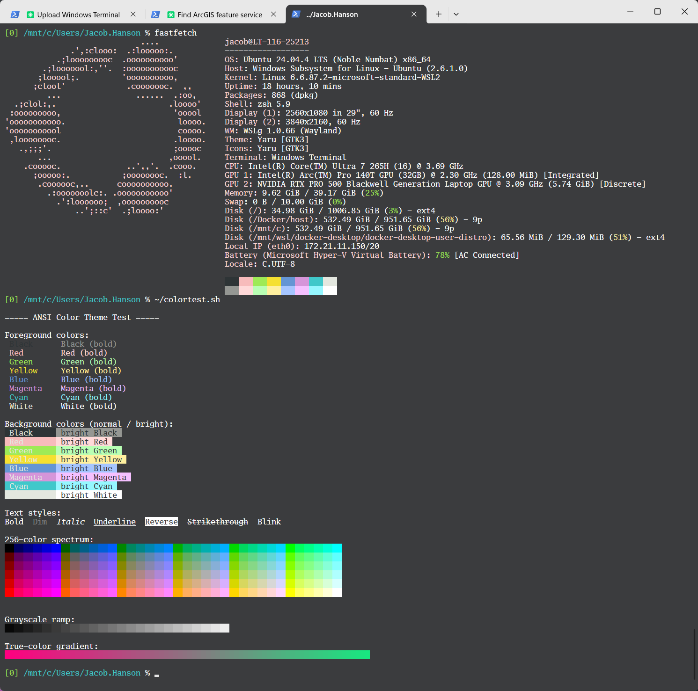

# Helsing — Windows Terminal

A [Windows Terminal](https://learn.microsoft.com/windows/terminal/) color scheme port of the **Helsing** theme — a high-contrast dark theme optimized for working under bright light / sunlight.

Based on the original JetBrains/IntelliJ theme **[Helsing](https://github.com/igrmk/helsing)** by [igrmk](https://github.com/igrmk).

## Preview

| Setting        | Color     |
| -------------- | --------- |
| Background     | `#3B3C3E` |
| Foreground     | `#FFFFFF` |
| Cursor         | `#CCCCCC` |
| Selection      | `#6165AD` |

## Installation

1. Open **Windows Terminal** → **Settings** → **Open JSON file** (gear icon, or `Ctrl+Shift+,`).
2. Add the contents of [`helsing.windowsterminal.json`](./helsing.windowsterminal.json) as a new object inside the top-level `"schemes"` array.
3. Save, then set the scheme for a profile: **Settings → Profiles → (your profile) → Appearance → Color scheme → Helsing**, or add `"colorScheme": "Helsing"` to a profile in the JSON.

## Credits

- Original IntelliJ theme: [igrmk/helsing](https://github.com/igrmk/helsing)
- Windows Terminal port: [@jacobhanson1010](https://github.com/jacobhanson1010)

## License

[MIT](./LICENSE)
